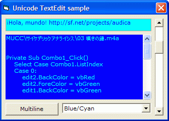



## TextEdit Usercontrol \(multiline, unicode, single file\)

### Description

2010-04-20: bugfix update + sample.

This is a usercontrol which can replace Textbox. It has multiline support, unicode support, events and doesn't need any additional modules. ASM is used for subclassing directly in usercontrol. Ok, maybe it needs some work to become more handy) I just converted my TextEdit class to usercontrol. Perhaps somebody (I?) will improve it later
 
### More Info
 

             |
---                |---
**Submitted On**   |2010-04-20 10:50:02
**By**             |[AndRAY](https://github.com/Planet-Source-Code/PSCIndex/blob/master/ByAuthor/andray.md)
**Level**          |Advanced
**User Rating**    |4.5 (18 globes from 4 users)
**Compatibility**  |VB 6\.0
**Category**       |[Custom Controls/ Forms/  Menus](https://github.com/Planet-Source-Code/PSCIndex/blob/master/ByCategory/custom-controls-forms-menus__1-4.md)
**World**          |[Visual Basic](https://github.com/Planet-Source-Code/PSCIndex/blob/master/ByWorld/visual-basic.md)
**Archive File**   |[TextEdit\_U2179314202010\.zip](https://github.com/Planet-Source-Code/andray-textedit-usercontrol-multiline-unicode-single-file__1-73063/archive/master.zip)

